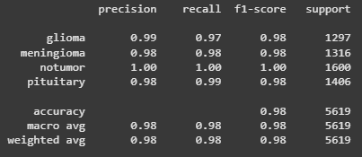

# Proiect PCLP3 - Partea I: Clasificarea Tumorilor Cerebrale

Nume: Tuca Mihai-Laurentiu
Grupa: 314CA

## 1. Descrierea Setului de Date

Pentru acest proiect, am utilizat datele aflate in directorul **All_Tumor_Labeled** (https://www.kaggle.com/datasets/orvile/brain-tumor-dataset am pus training + test intr-un singur director urmand sa fie separate ulterior). Acesta contine imagini ale creierului uman, clasificate in patru categorii distincte:

*   **Glioma**: Imagini reprezentand tumori de tip gliom.
*   **Meningioma**: Imagini reprezentand tumori de tip meningiom.
*   **No Tumor**: Imagini ale creierului sanatos, fara prezenta tumorilor.
*   **Pituitary**: Imagini reprezentand tumori hipofizare (pituitare).

Setul de date este structurat in subdirectoare, fiecare corespunzand uneia dintre aceste patru clase. Numarul total de imagini este de aproximativ 7023, distribuite astfel:
*   Glioma: ~1621 imagini
*   Meningioma: ~1645 imagini
*   No Tumor: ~2000 imagini
*   Pituitary: ~1757 imagini

Tipul problemei abordate este **clasificare multi-clasa**, unde scopul este de a antrena un model capabil sa prezica tipul de tumora (sau absenta unei tumori) pe baza caracteristicilor extrase din imagini.

Pentru a pregati datele pentru antrenarea unui model de machine learning, am efectuat urmatorii pasi de preprocesare si extragere de caracteristici.

### 1.1. Incarcarea si Preprocesarea Imaginilor

1.  **Iterarea prin directoare**: Scriptul parcurge fiecare subdirector (clasa de tumora) din `All_Tumor_Labeled`.
2.  **Citirea imaginilor**: Fiecare imagine este citita folosind biblioteca Pillow (PIL).
3.  **Conversia in tonuri de gri**: Imaginile sunt convertite in tonuri de gri si sunt redimensionate la o dimensiune standard de 256x256 pixeli.
5.  **Conversia in array numpy**: Imaginea preprocesata este convertita intr-un array numpy pentru a face usoare calculele.

### 1.2. Ce Informatii Am Extras din Imagini?

Dupa ce am separat creierul de fundalul negru (cu o metoda numita Otsu), am calculat pentru fiecare imagine urmatoarele caracteristici statistice din pixelii regiunii creierului:

1.  **`mean_intensity`**: Media intensitatii pixelilor normalizati (0-1).
2.  **`std_intensity`**: Deviatia standard a intensitatii (contrast).
3.  **`skewness`**: Asimetria distributiei intensitatilor.
4.  **`max_intensity`**: Intensitatea maxima (cel mai luminos pixel).
5.  **`contrast`**: Contrastul local din imagine, calculat din GLCM (Gray Level Co-occurrence Matrix) pe imaginea redimensionata in tonuri de gri (0-255). Masoara variatia locala a intensitatilor.
6.  **`energy`**: O masura a uniformitatii texturii, calculata din GLCM. Valori mari indica o textura mai omogena.
7.  **`homogeneity`**: Omogenitatea locala a imaginii, calculata din GLCM. Masoara cat de similari sunt pixelii vecini.
8.  **`dissimilarity`**: Disimilaritatea locala, calculata din GLCM.
9.  **`correlation`**: Corelatia dintre intensitatile pixelilor vecini, calculata din GLCM. Indica linearitatea structurilor din imagine.
10. **`entropy`**: Entropia imaginii, calculata din GLCM. Masoara randomness sau complexitatea texturii.
11. **`tumor_type`**: Eticheta categoriei (ex: 'glioma', 'meningioma', 'notumor', 'pituitary').

**Observatii**: Initial, am folosit niste caracteristici foarte simple (precum `min_intensity`, `median_intensity`, `median_intensity`, `max_intensity`). Dupa ce am ajuns la EDA si am vazut relatiile foarte mari intre caracteristici (>0.9 sau unele chiar 0.98 - 0.99), am ales sa caut seturi de date asemanatoare si sa ma inspir cu privinta la caracteristicile pe care le-as putea folosi (am decis sa iau caracteristici asemanatoare cu acest dataset https://www.kaggle.com/datasets/jakeshbohaju/brain-tumor). De asemenea am adaugat normalizarea pixelilor (impartirea cu 255) care nu se facea inainte.

### 1.3. Cum Am Salvat Informatiile?

Caracteristicile extrase pentru fiecare imagine, impreuna cu label-ul tumorei (`tumor_type`) sunt stocate intr-un dataframe din pandas. Acest dataframe este apoi salvat intr-un fisier CSV (`brain_tumor_features.csv`), care va constitui setul de date tabelar utilizat pentru etapele urmatoare ale proiectului.

### 1.4. Observatii si Procesari Suplimentare

Initial, caracteristicile au fost calculate direct pe baza tuturor pixelilor din imaginile redimensionate. Cu toate acestea, am observat ca fundalul predominant negru al imaginilor RMN afecta in mod semnificativ aceste caracteristici. 

Pentru a adresa aceasta problema si a obtine corect valorile caracteristicilor, s-a implementat o metoda de calcul al threshold-ului pixelilor **Otsu** (din biblioteca `scikit-image`). Pentru fiecare imagine, algoritmul Otsu determina un prag optim pentru a separa pixelii din prim-plan de cei din fundal. Ulterior, toate caracteristicile au fost recalculate luand in considerare doar pixelii identificati ca apartinand prim-planului. Aceasta implementare nu este cea mai optima, dar este rapida, necesita doar o apelare de functie, `threshold_otsu` si ne ajuta sa avem totusi un set de date mai relevant.

Desi datele de pe Kaggle veneau deja impartite in train si test, am ales sa punem toate imaginile in folderele lor, pe baza etichetei. Am facut acest lucru ca sa putem aplica procesul de augmentare pe toate datele de la inceput, inainte sa le impartim din nou in train si test dupa preprocesare si augmentare.

### 1.5. Tehnici de augmentare

Initial, setul nostru de date era alcatuit doar din cele 7023 de imagini cu creierul uman cu caracteristicile specificate anterior. La antrenarea unui model cu ajutorul Random Forest Classifier pe acest set de date am avut o acuratete de ~90%. Pentru a genera sample-uri noi, am aplicat asupra imaginilor originale 3 modificari,
    * Oglindirea imaginii originale
    * Aplicarea unui unghi de rotatie (aflat in [-20, 20]) imaginii
    * Aplicarea atat rotatiei cat si oglindirea imaginii
Aceste trei modificari au construit la randul lor inca 7023 de imagini fiecare si au fost calculate aceleasi caracteristici ca imaginilor originale, apoi au fost adaugate setului de date original, in final ajungand la 28092 de imagini pe care le vom folosi mai incolo, de 4 ori mai multe date decat initial. Cu ajutorul acestor augmentari asupra imaginilor originale, acelasi model Random Forest Classifier a ajuns sa aiba o acuratete de ~98%, mult mai buna decat initialul rezultat. Dezavantajul acestei metode este memoria in plus pe care trebuie sa o avem pentru salvarea csv-ului final (600kb -> 2.6Mb, nesemnificativ datorita putinelor poze, dar pentru un set de milioane sau chiar zeci de milioane de date, aceasta crestere proportionala la numarul original de date aduce o nevoie de foarte multa memorie), dar si timpul necesar preprocesarii acestor date este notabil mai mare. Nefiind restransi de timp sau memorie consider ca aceste transformari sunt perfecte modelului nostru.

## 2. Pregatirea Datelor pentru Antrenament

Dupa extragerea caracteristicilor in `brain_tumor_features.csv`, impartim datele in training si test

1.  **Impartire Train/Test**: Setul de date este impartit:
    *   80% pentru antrenarea modelului (`train.csv`).
    *   20% pentru testarea modelului (`test.csv`).
2.  **Amestecare (Shuffle)**: Datele sunt amestecate aleatoriu inainte de impartire pentru a asigura ca seturile de antrenament si test sunt reprezentative.
3.  **Stratificare**: Impartirea se face stratificat pe baza coloanei `tumor_type`. Acest lucru asigura ca fiecare tip de tumora este prezent in proportii similare atat in setul de antrenament, cat si in cel de test, pentru a nu favoriza o anumita tumora.

4.  **Reproductibilitate**: Se foloseste o valoare fixa pentru `random_state` pentru ca impartirea sa fie identica la fiecare rulare a scriptului.

Fisierele rezultate, `train.csv` si `test.csv`, contin datele gata pentru a fi folosite la antrenarea si evaluarea modelului.

## 3. Analiza Exploratorie a Datelor (EDA)

Am facut o Analiza Exploratorie a Datelor (EDA) pe seturile de antrenament si test pentru a intelege mai bine datele. (Histogramele si graficele se pot vedea de asemenea si in notebook-ul atasat)

### 3.1. Verificarea Valorilor Lipsa

Setul de date este complet si nu are valori lipsa (NaN), asa cum ne asteptam. Nu a trebuit sa completam nimic.

### 3.2. Consistenta Statisticilor Descriptive

Statisticile de baza (medie, deviatie standard) ale caracteristicilor sunt foarte asemanatoare intre seturile de antrenament si test (de ex., `mean_intensity` e ~0.379 in train si ~0.377 in test). Asta, plus faptul ca `tumor_type` e impartit la fel in ambele seturi, arata ca datele sunt bine impartite.

### 3.3. Similaritatea Distributiilor Caracteristicilor

Histogramele arata ca valorile fiecarei caracteristici se distribuie cam la fel in setul de antrenament si cel de test. Asta inseamna ca ambele seturi sunt la fel si pot fi folosite pentru model.

### 3.4. Corelatia Intre Caracteristici (Heatmap)

Matricea de corelatie a aratat ca unele caracteristici sunt legate puternic intre ele (ex: `energy` si `homogeneity` pozitiv), altele invers (ex: `dissimilarity` si `correlation` negativ). Caracteristici ca `skewness` si `contrast` par mai independente. Corelatiile mari inseamna ca avem informatie redundanta, deci poate ar fi util sa combinam unele din aceste caracteristici sau sa folosim tehnici de reducere a dimensionalitatii sau de selectie a caracteristicilor pentru a gestiona aceasta redundanta.

### 3.5. Relatia dintre Caracteristici si Clasa Tinta (Violin Plots)

Graficele violin arata cum se distribuie fiecare caracteristica pentru fiecare `tumor_type`. Pentru `notumor`, unele caracteristici (`mean_intensity`, `std_intensity`, `contrast`, `energy`, `dissimilarity`) au de obicei valori mai mari. `skewness` si `entropy` arata diferit pentru fiecare clasa. Majoritatea caracteristicilor par utile pentru a deosebi tumorile.

### 3.6. Valori Extreme si Distributia Datelor (Boxplots)

Boxplot-urile arata ca avem valori extreme (outlieri) la majoritatea caracteristicilor, mai ales la `contrast` si `dissimilarity`. Imprastierea valorilor e diferita de la o caracteristica la alta.

In concluzie, EDA a aratat ca datele sunt de calitate. Caracteristicile alese par bune pentru a deosebi tipurile de tumori. Ce am vazut despre corelatii si outlieri ne va ajuta sa imbunatatim modelul.

## 4. Antrenarea si Evaluarea Modelului

Pentru a clasifica tipurile de tumori, am folosit un model **Random Forest Classifier** din biblioteca `scikit-learn`. Am ales acest model pentru ca este cunoscut ca fiind performant pentru astfel de probleme de clasificare pe date tabelare si nu necesita neaparat scalarea caracteristicilor.

### 4.1. Procesul de Antrenare

Modelul a fost antrenat folosind setul de date de antrenament (`train.csv`), care contine 80% din totalul de 28092 de imagini (originale si augmentate). Variabila tinta a fost `tumor_type`, iar caracteristicile au fost cele 10 definite anterior.

### 4.2. Evaluarea Performantei si Impactul Augmentarii

Performanta modelului antrenat a fost evaluata pe setul de test (`test.csv`). Este important de mentionat ca, inainte de a aplica tehnicile de augmentare a datelor (cand lucram doar cu cele ~7000 de imagini originale), un model similar Random Forest obtinea o acuratete de aproximativ 90%. Dupa augmentarea datelor la ~28000 de imagini, performanta a crescut considerabil:

*   **Acuratetea (Accuracy):** Procentul de predictii corecte.
    *   Acuratetea pe setul de test (cu date augmentate): **0.9847** (sau 98.47%)

*   **Precizie, Recall si F1-Score (per clasa):**

Valorile sunt foarte bune pentru toate clasele, cu o distinctie aproape perfecta pentru clasa `notumor`. (1598/1600) Cel mai mic recall (0.97) este pentru `glioma`, indicand ca o mica parte (3%) din aceste tumori sunt inca gresit clasificate.

*   **Matricea de Confuzie:** Arata unde face modelul erori.

Matricea confirma performanta generala excelenta. Un aspect deosebit de important, vizibil si aici, este numarul foarte mic de cazuri reale de tumori (`glioma`, `meningioma`, `pituitary`) care sunt clasificate gresit ca `notumor`. Aceasta este o caracteristica pozitiva majora, deoarece, din punct de vedere medical, a rata o tumora existenta (un fals negativ pentru clasele de tumori) ar avea consecinte mult mai grave decat a clasifica gresit un tip de tumora cu un altul sau a clasifica un caz sanatos ca avand o tumora (un fals pozitiv). Matricea arata, de asemenea, putinele confuzii intre diferitele tipuri de tumori (ex: `glioma` confundat uneori cu `meningioma` sau `pituitary`).

### 4.3. Interpretarea Rezultatelor

Cresterea acuratetei de la ~90% la **98.47%** demonstreaza clar beneficiul augmentarii datelor. Modelul Random Forest a reusit sa invete mult mai eficient cu un set de date mai mare si mai divers.
Precizia si recall-ul ridicate, in special identificarea aproape perfecta a cazurilor `notumor`, sunt rezultate foarte bune. Chiar daca raman cateva erori, cum ar fi pentru clasa `glioma`, numarul lor este mic. Acestea pot fi cauzate de asemanari vizuale intre tumori sau de faptul ca cele 10 caracteristici extrase, desi bune, s-ar putea sa nu surprinda absolut toate diferentele subtile.

Pe langa rezultatele actuale, performanta modelului ar putea fi imbunatatita si mai mult prin explorarea mai multor tehnici de augmentare, adaugand si mai multe poze setului de date. Pe langa oglindire si rotatie, transformari precum ajustari subtile de luminozitate si contrast sau adaugarea de zgomot ar putea fi relevante medical si ar putea ajuta modelul sa devina si mai bun. Acestea ar simula variatiile intalnite in practica medicala. Aplicarea cu grija a unor astfel de tehnici, pentru a evita generarea de date nerealiste, ar putea contribui la o acuratete chiar mai mare si la o mai buna generalizare a modelului. Totusi, este important ca aceste augmentari sa fie aplicate cu moderatie, transformari prea agresive sau numeroase pot genera date nerealiste si pot chiar inrautati performanta modelului. De asemenea, multiplicarea excesiva a datelor prin augmentari multiple creste semnificativ timpul de preprocesare si necesarul de spatiu de stocare pentru caracteristicile extrase.

In concluzie, modelul Random Forest antrenat pe datele augmentate si cu caracteristicile extrase s-a dovedit a fi foarte eficient in clasificarea tumorilor cerebrale.